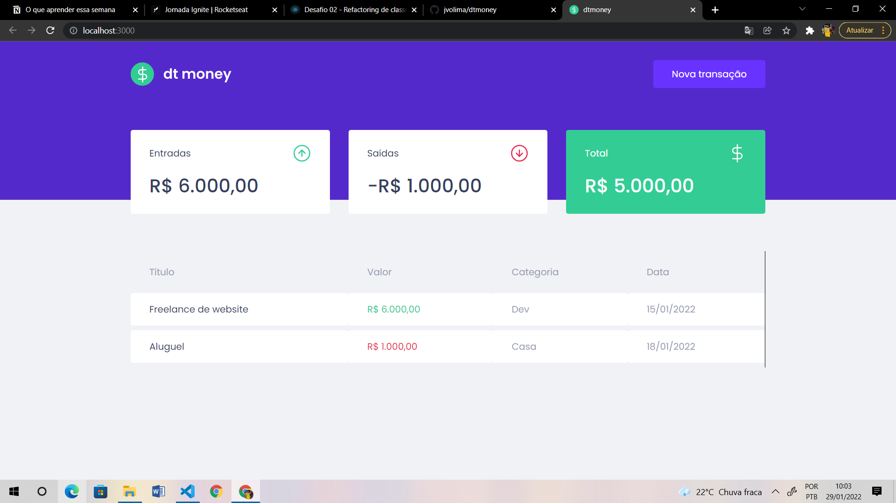
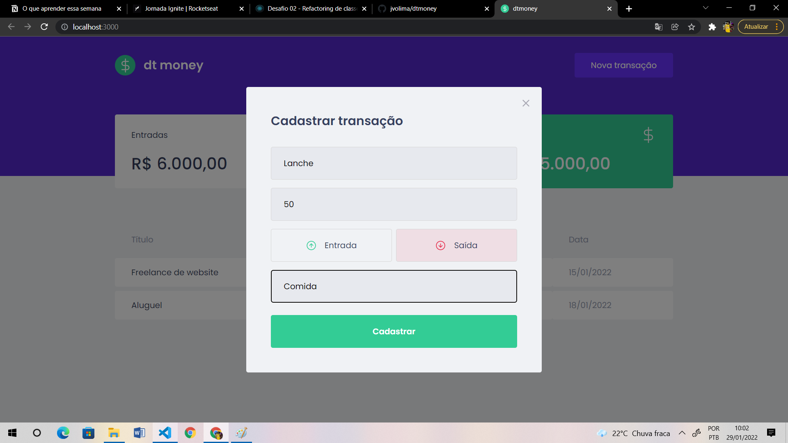

# DTmoney 💸

## Aplicação feita em React utilizando o Typescript 🚀

## O que a aplicação faz?
- É uma aplicação que lista transações feitas pelo usuário
- Essas transações podem ser de entradas ou saídas
- No cabeçalho da aplicação tem o resumo das transações, que calcula o total de entradas, o total de saídas, e o Total diminuindo as saídas das entradas
- O usuário pode cadastrar uma nova transação, para isso ele precisar informar o título da transação, a categoria, se é uma entrada ou uma saída, e o valor dessa transação

## Tecnologias utilizadas ⚙️
- React
- Typescript
- Styled-components
- MirageJS

## Habilidades desenvolvidas 👨‍💻
- Criação de hooks
- useState e useEffect
- Estilização com styled-components
- Compartilhar um estado entre dois ou mais componentes
- Fake API com MirageJS

## Tela inicial da aplicação


## Tela de cadastro de uma nova transação


## Como executar a aplicação 💻
- Clone o repositório 
- Abra a pasta do repositório no terminal
- Execute o comando ```yarn``` para instalar as dependências do projeto
- Abra o projeto no vscode
- Execute o comando ```yarn start``` e pronto, com isso a aplicação estará rodando na sua máquina!